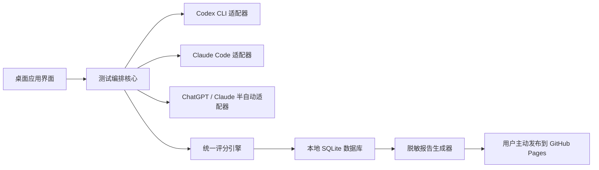
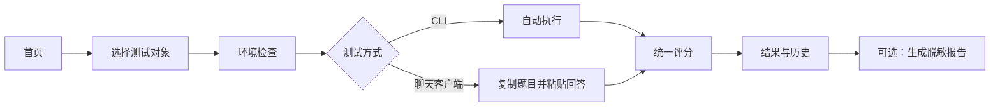

# AI 能力雷达：完整桌面产品设计

- 状态：已由用户逐节确认
- 日期：2026-07-17
- 工作名称：AI 能力雷达
- 副标题：本地优先的 AI 表现与降智检测工具
- 首发平台：Windows

## 1. 背景与目标

用户关心 ChatGPT、Claude、Codex CLI 和 Claude Code 是否出现能力下降，但一次主观体验无法区分模型波动、客户端路由、工具配置、网络、额度限制和真正的能力变化。现有 Codex 雷达使用真实软件工程题持续观察编程代理，但不能直接测量普通聊天客户端，也不适合每位订阅用户在本机低成本运行。

本产品提供一个完整桌面应用，让订阅用户在不提供 API 密钥、不上传原始对话的前提下，分别检测：

1. ChatGPT 和 Claude 客户端的端到端产品表现。
2. Codex CLI 和 Claude Code 的编程代理表现。
3. 相同测试对象相对个人历史基线的变化。
4. 结果变化是否超过正常波动，以及结论有多可靠。

产品不声称直接测得底层模型权重的“智商”。客户端结果代表端到端产品体验；CLI 结果代表模型、CLI、工具权限和配置共同形成的代理表现。

## 2. 已确认的产品决策

1. 采用完整桌面应用路线，而不是纯网页或临时本地网页。
2. 从轻量版本开始，但所有阶段沿同一模块化架构演进。
3. Windows 始终是主平台；第五阶段在继续支持 Windows 的同时增加 macOS 和 Linux。
4. CLI 测试自动运行；普通聊天客户端首版采用复制题目、粘贴回答的半自动向导。
5. 原始回答、日志和历史默认只保存在本机。
6. 用户主动确认后才能生成或发布脱敏报告。
7. GitHub 负责源码、安装包、文档、静态报告和未来社区汇总，不负责集中运行模型测试。
8. 测试消耗运行者自己的订阅额度；项目不提供统一模型 API 密钥。
9. Chat 客户端和 CLI 分开计分，不合并为一个总分。
10. 用户可选择快速体检和深度检测；默认运行快速体检。
11. 不使用通过率乘以 150 的伪 IQ 作为核心指标。

## 3. 范围与非目标

### 3.1 首个公开预览版的范围

首个公开预览版为 v0.2，包含：

- Windows 桌面安装和本地数据存储。
- ChatGPT 与 Claude 的半自动客户端测试。
- Codex CLI 与 Claude Code 的自动检测和自动测试。
- 8 道客户端快速题：3 道指令遵循、3 道逻辑推理、2 道代码审查。
- 2 道 CLI 微型代码题。
- 运行进度、取消、恢复和错误分类。
- 本地结果、历史记录、分类分数和静态 HTML 报告。
- 发布前脱敏预览。

### 3.2 明确不属于 v0.2 的内容

- 自动点击或操控 ChatGPT、Claude 窗口。
- 公共排行榜和社区上传服务。
- 服务端模型 API 或维护者共享密钥。
- 完整 DeepSWE 批量运行。
- macOS、Linux 和 Windows ARM64 安装包。
- 依赖模型评审的主观创意题。
- 后台静默运行、静默上传或默认遥测。

### 3.3 后续阶段的独立边界

本文件是完整产品的主设计。单次实施计划只覆盖 v0.1 和 v0.2。v0.5、v0.8、v1.0 和 v2.0 在进入开发前分别编写增量规格和实施计划，避免形成无法可靠交付的超大任务。

## 4. 总体架构



组件之间通过版本化接口交换数据。增加新模型、CLI、客户端、题包或评分器时，只增加适配器或插件，不修改其他组件的内部实现。

### 4.1 桌面界面

职责：

- 引导用户选择测试对象和测试模式。
- 完成环境检查、进度展示和错误说明。
- 为聊天客户端提供复制题目和粘贴回答流程。
- 展示结果、历史、可信度和脱敏预览。

界面不直接执行任意系统命令，不直接访问数据库，也不持有登录凭据。所有有权限的操作通过有限的内部命令交给 Rust 核心。

### 4.2 测试编排核心

职责：

- 加载并验证题包。
- 建立运行计划和环境指纹。
- 调用对应适配器。
- 管理超时、取消、恢复和临时目录。
- 把有效结果交给评分引擎。
- 将无效运行与模型失败分开。

核心不知道具体 CLI 参数，由适配器实现细节；适配器也不直接计算产品分数。

### 4.3 适配器

每个适配器实现统一能力：

- 检测是否可用。
- 返回版本和可公开的能力信息。
- 验证是否已经登录，但不读取凭据。
- 启动、观察、取消一次测试。
- 把原始事件转换为统一运行事件。
- 将 CLI 变化转换为明确的兼容错误。

v0.2 包含 Codex、Claude Code、ChatGPT 手动和 Claude 手动四个适配器。

### 4.4 评分引擎

职责：

- 对单题结果进行确定性评分。
- 生成分类分数、能力分和原始通过数。
- 记录评分器版本。
- 为后续基线和可信度计算提供稳定输入。

评分器不发起网络请求。模型评审不属于 v0.2 的默认能力。

### 4.5 报告生成器

职责：

- 从数据库读取允许发布的字段。
- 通过字段白名单构造报告。
- 再次扫描可能的用户名、绝对路径、令牌和敏感文本。
- 生成静态 HTML 和 JSON。
- 在发布前向用户展示完整内容。

## 5. 用户流程



### 5.1 首页

- 一个主要按钮：“开始 AI 体检”。
- 聊天客户端和编程 CLI 分区展示。
- 显示最近一次结果、样本量和变化状态。
- 只有数据足够时才显示“疑似下降”或“明显下降”。

### 5.2 新建检测

用户选择：

- ChatGPT、Claude、Codex CLI 或 Claude Code。
- 实际使用的模型和推理档位。
- 快速体检或深度检测。

应用默认沿用最近一次可比配置。模型或题包变化时明确提示将创建新趋势线。

### 5.3 环境检查

CLI 模式：

- 检查命令是否存在。
- 获取 CLI 版本。
- 使用 CLI 自身状态判断是否可运行。
- 仅显示状态和修复引导，不读取认证文件。

客户端模式：

- 提醒用户打开全新对话。
- 明确要求关闭联网搜索或其他工具，除非当前题组允许。
- 记录用户选择的客户端、模型和档位。

### 5.4 测试进行中

CLI：

- 在本次运行专用临时目录中执行。
- 显示当前题目、进度、耗时和安全停止状态。
- 捕获结构化事件，不把调试日志直接展示给普通用户。

客户端：

- 一次显示一道题。
- 提供“复制题目”和“粘贴回答”操作。
- 保存用户实际提交的回答。
- 每道题提示使用全新对话。

### 5.5 结果与历史

- 分别展示能力分、分类分、原始通过数和错误原因。
- 不把不同测试对象合并。
- 相同题包和配置才进入同一趋势。
- 技术日志默认折叠。
- 用户可以为一次测试添加备注。

### 5.6 发布

- 生成前展示即将包含的字段。
- 原始回答、日志、用户名、设备名和绝对路径默认排除。
- 用户可以只保存到本地。
- v0.2 仅导出报告包；自动推送 GitHub 属于 v0.8。

## 6. 题库设计

### 6.1 聊天客户端题库

| 分类 | v0.2 数量 | 内容 | 判分 |
|---|---:|---|---|
| 指令遵循 | 3 | 格式、数量、禁止项和组合限制 | 结构及规则检查 |
| 逻辑推理 | 3 | 可验证的逻辑、排序和计算问题 | 标准答案 |
| 代码审查 | 2 | 在固定代码或差异中识别已知问题 | 缺陷点匹配 |

深度检测在 v0.5 增加长文本理解、多步关联、题目重复和更多变体。

默认客户端题组禁止联网搜索。未来联网能力使用独立题组和独立趋势，避免搜索质量污染基础能力结果。

### 6.2 CLI 题库

分为：

1. 微型代码题：v0.2 内置，两道小型临时项目任务。
2. 真实仓库轻量题：v0.5 引入，使用固定提交和自动测试。
3. DeepSWE 兼容题：v0.5 提供入口，深度运行由用户主动选择。

CLI 题采用程序测试判分。超时、额度耗尽、网络失败和验证器异常不计作能力失败。

### 6.3 锚点与变体

题库包含：

- 固定锚点题：保持长期可比性。
- 等难度变体题：使用确定性随机种子替换数字、文本和代码细节。

题包必须包含：

- 题包 ID、语义化版本、内容哈希和许可证。
- 支持的测试对象和能力分类。
- 用户可见题目。
- 评分器 ID 和版本。
- 超时、资源等级和预计消耗等级。
- 是否允许网络、文件编辑和命令执行。

v0.2 只运行随应用签名发布的官方题包。社区题包在具备独立沙箱和权限声明前不能执行任意脚本。

### 6.4 DeepSWE 使用边界

DeepSWE 适合长时真实软件工程测试，但不适合默认快速体检。正式收录前必须完成许可证和再分发审查。若不能随应用分发，应用只提供从官方来源下载、校验和导入的流程。

## 7. 评分与降智判定

### 7.1 能力分

- 每条测试通道单独计算 0–100 分。
- 先计算每个分类内部平均分，再等权平均分类分，防止题目数量更多的分类自动占更大权重。
- 同时显示原始通过数，例如 `6/8`。
- CLI 与聊天客户端不共享一个能力分。

### 7.2 基线

- 只有测试对象、模型档位、题包版本和关键设置一致的结果才可比较。
- 至少积累 3 次可比检测后建立个人基线。
- 基线中心使用历史中位数。
- 正常波动使用中位绝对偏差估计，降低单次异常影响。

### 7.3 可信度

可信度考虑：

- 有效题目数量。
- 重复次数。
- 分类覆盖。
- 历史波动。
- 环境配置匹配程度。
- 是否出现超时、恢复或手动修正。

快速体检最高给出中等可信度。高可信结论需要深度检测、配对题目或连续多次下降。

二元通过率使用 95% Wilson 区间；配对分数变化使用固定随机种子的自助法 95% 区间，确保同一数据重复计算结果一致。

### 7.4 初始告警规则

- 正常波动：下降未超过 5 分，且未超过个人正常波动的 1.5 倍。
- 疑似下降：下降超过 5 分或个人正常波动的 1.5 倍，取更严格阈值。
- 明显下降：下降超过 10 分，并在重复测试或至少两个分类中再次出现。
- 高可信下降：配对变化的 95% 区间仍低于 0，或连续两次深度检测出现明显下降。
- 样本不足：展示当前结果，不生成降智结论。

上述阈值是首版预警规则。v0.5 使用真实试运行数据校准，但历史报告必须保留当时规则版本，不能静默重写旧结论。

## 8. 技术选型

- 桌面框架：Tauri。
- 界面：React 和 TypeScript。
- 本地核心：Rust。
- 数据库：SQLite。
- 安装和更新：GitHub Releases 与签名更新。
- 官网和公开报告：静态 HTML/JSON 与 GitHub Pages。
- 许可证：应用代码使用 Apache-2.0；题包和第三方内容维护独立许可清单。

Tauri 的能力权限用于限制窗口可调用的内部命令。前端不能直接获得通用 Shell 或文件系统权限。

## 9. CLI 执行与隔离

### 9.1 Codex

适配器使用官方非交互模式：

- 临时会话。
- JSONL 事件输出。
- 代码题只使用工作区写入沙箱。
- 固定当前工作目录。
- 固定超时。
- 终止时结束完整子进程树。
- 不使用全盘访问模式。

标准基准模式忽略用户项目规则和与题目无关的个性配置，但继续复用 CLI 已保存的认证。个人体验模式属于后续扩展，不进入 v0.2 基线。

### 9.2 Claude Code

适配器使用：

- 非交互打印模式。
- JSON 或流式 JSON 输出。
- 固定最大代理轮数。
- 按题生成允许和禁止工具列表。
- 固定工作目录和超时。

不使用跳过全部权限检查的危险参数。每道题只允许读取、编辑当前临时项目，并允许题目声明的精确测试命令。

### 9.3 首版隔离声明

模型服务本身需要联网，因此 v0.2 不宣称完全断网或达到恶意代码隔离。v0.2 的安全措施是：

- 专用临时目录。
- CLI 自身工作区权限。
- 工具白名单。
- 进程超时和完整终止。
- 内置签名题包。
- 禁止访问用户项目。

真实仓库和 DeepSWE 任务在 v0.5 采用容器或 WSL 隔离，并在界面显示实际安全等级。

## 10. 本地数据设计

SQLite 至少包含：

- `runs`：一次测试的状态、时间、模式和总体结果。
- `targets`：测试对象、模型、档位及客户端或 CLI 版本。
- `suite_versions`：题包版本、哈希和评分器版本。
- `task_results`：每题状态、分数、耗时和错误分类。
- `baselines`：可比序列、中心值、波动和规则版本。
- `publications`：导出时间、报告哈希和目标位置。

原始回答和较大 CLI 日志保存在应用数据目录的按运行 ID 分隔文件中。数据库只保存相对引用，不保存用户目录的绝对路径。

用户可以：

- 删除单次运行。
- 删除某个测试对象的全部历史。
- 只删除原文并保留分数。
- 导出完整本地备份。
- 设置原始日志保留期限。

v0.2 不保存任何 ChatGPT、Claude 或 GitHub 访问令牌。

## 11. 错误处理

运行状态必须区分：

- CLI 未安装。
- CLI 未登录或登录失效。
- 额度耗尽。
- 网络中断。
- 用户取消。
- 应用异常或电脑重启。
- 任务超时。
- 验证器异常。
- 模型完成但答案或测试未通过。

只有最后一种计入能力失败。其他状态标记为无效样本或运行稳定性信息。

每完成一道题就持久化检查点。应用重新启动后可以恢复未完成运行；恢复运行会在环境指纹中留下标记，并降低可比性，不能静默当作完全正常样本。

## 12. 隐私与安全

### 12.1 数据最小化

- 不扫描完整环境变量。
- 只读取白名单中的版本和状态信息。
- 不读取 CLI 认证文件内容。
- 不监控客户端登录输入框。
- v0.2 不包含默认遥测。

### 12.2 报告白名单

允许发布：

- 测试对象和用户填写的模型档位。
- 应用、CLI、题包和评分器版本。
- 分数、样本数、耗时、可信度和错误分类统计。
- 粗粒度操作系统信息。
- 随机匿名报告编号。

默认禁止：

- 原始回答和完整日志。
- 用户名、电脑名和绝对路径。
- 访问令牌、认证文件和完整环境变量。
- 稳定设备指纹。

### 12.3 更新与供应链

- 发布采用语义化版本。
- 安装包生成校验值。
- 自动更新在签名基础设施完成前保持关闭。
- 正式版更新必须验证签名并使用 TLS。
- 发布密钥仅在受保护的正式发布工作流中使用。
- 题包和评分器校验签名或内容哈希。
- 正式公开稳定版完成 Windows 代码签名。

## 13. GitHub 架构

建议单仓库结构：

```text
apps/desktop          桌面界面
crates/core           编排、评分和数据核心
crates/adapters       CLI 与客户端适配器
benchmark-packs       官方题包
schemas               题包与报告格式
site                  官网、文档和示例报告
docs                  产品、隐私、安全和贡献说明
.github/workflows     测试、构建、发布和 Pages
```

GitHub 提供：

- 源码、Issues 和贡献流程。
- Windows 安装包、校验值和发布说明。
- 官网、文档和示例报告。
- 题包与评分器版本。
- 未来的社区汇总数据。

用户本机运行模型测试。v0.2 导出个人静态报告包；v0.8 在检测到已登录 GitHub CLI 时提供一键发布；v1.0 增加 GitHub 设备授权和个人报告仓库管理。

未来社区结果按可信等级展示：

1. 手动客户端结果。
2. 本地自动验证结果。
3. 带题包、补丁和验证器记录的可复现 CLI 结果。
4. 服务端干净环境复测结果。

本地签名只能证明报告格式、来源应用版本和历史连续性，不能证明用户绝对没有篡改数据。

## 14. 版本路线

### 14.1 v0.1 工程基础

交付：

- Tauri、React、Rust 和 SQLite 骨架。
- 内部接口、数据格式和数据库迁移。
- Windows 开发安装包。
- 基础隐私、日志和错误分类。
- 自动测试和文档工作流。

验收：

- 可在干净 Windows 10/11 x64 环境安装、启动和卸载。
- 迁移失败不损坏已有数据。
- 前端不能直接执行任意系统命令。
- 自动测试和 Pages 构建通过。

### 14.2 v0.2 轻量可用版

交付本文件第 3.1 节定义的首版范围。

验收：

- 非技术用户无需输入命令即可完成检测。
- 客户端快速体检目标时间为 10–15 分钟。
- CLI 快速体检目标时间为 30–60 分钟；超出时显示真实耗时，不伪造保证。
- 登录、额度和网络错误不计作模型失败。
- Codex 与 Claude Code 任一未安装时，另一条通道仍可使用。
- 脱敏测试不泄漏用户名、绝对路径和令牌。
- 相同输入重复评分得到相同结果。

### 14.3 v0.5 可靠检测版

- 个人基线、配对比较和可信度。
- 深度检测、题目重复和变体。
- 真实仓库轻量题与 DeepSWE 兼容入口。
- 容器或 WSL 隔离。

进入 v0.5 前必须先完成 v0.2 的真实用户试运行和指标校准规格。

### 14.4 v0.8 增强桌面版

- 剪贴板辅助、快捷键和通知。
- 签名更新、备份恢复和自动清理。
- GitHub CLI 一键发布。
- Windows 客户端自动化实验适配器。
- 自动化失败时始终可退回手动流程。

### 14.5 v1.0 完整社区版

- 稳定签名 Windows 安装包。
- GitHub 设备授权。
- 自愿社区提交、趋势和可信等级。
- 分布式高成本任务认领。
- 可选服务端复测及明确预算。

### 14.6 v2.0 多平台与生态化

- Windows 保持完整主平台。
- macOS 和 Linux。
- 题包、评分器和 CLI 适配器插件规范。
- 本机定时检测和更多模型。
- 第三方插件权限声明与签名。

## 15. 测试与发布门槛

### 15.1 测试层级

1. 核心单元测试：评分、基线、可信度和版本比较。
2. 评分器金标测试：固定输入对应固定输出。
3. 适配器契约测试：使用模拟 CLI 事件，不消耗订阅。
4. 集成测试：运行内置微型题和验证器。
5. Windows 端到端测试：安装、升级、运行、恢复、导出和卸载。
6. 安全测试：命令注入、路径穿越、恶意题包、脱敏遗漏和数据库损坏。

真实订阅测试不进入普通 GitHub CI。它只在人工发布验证或测试者自愿环境运行。

### 15.2 正式发布门槛

- 自动测试全部通过。
- 新旧数据库迁移通过。
- 脱敏扫描通过。
- 干净 Windows 虚拟机安装和卸载通过。
- 旧版本数据可打开。
- CLI 兼容表已更新。
- 发布说明明确列出评分、题包和数据格式变化。

## 16. 风险与应对

| 风险 | 应对 |
|---|---|
| CLI 参数或输出变化 | 独立适配器版本、兼容检查、契约测试 |
| 客户端界面变化 | 手动复制粘贴始终可用 |
| 订阅路由不透明 | 只声明端到端产品表现 |
| 题目被记忆 | 固定锚点、等难变体和版本记录 |
| 测试消耗过高 | 开始前显示时间和低/中/高消耗等级 |
| 自动化权限过大 | 独立、最小、默认关闭、可撤销 |
| 题库许可不清 | 未审查题包不随应用分发 |
| 社区数据作弊 | 可信分层、异常隔离和服务端复测 |
| Windows SmartScreen | 预览版校验值，稳定版代码签名 |
| 误报降智 | 样本不足不下结论，始终展示可信度 |

## 17. 视觉与文字原则

- 使用“体检仪表盘”而不是娱乐排行榜风格。
- 绿色、黄色和红色同时配合文字与图标，不只依赖颜色。
- 不使用“模型已经变笨”等确定性措辞。
- 普通结论优先，技术日志默认折叠。
- 支持浅色、深色、键盘操作和基本无障碍。
- v0.2 提供中文界面；代码从第一天支持国际化，英文在后续版本加入。
- 工作名称“AI 能力雷达”用于开发和文档，品牌命名不阻塞 v0.2。

## 18. 成功标准

v0.2 成功意味着：

- 非技术用户可以独立完成一次客户端或 CLI 检测。
- 开始前清楚显示预计时间和消耗等级。
- 无效运行不会污染能力分。
- 相同历史数据始终得到相同结论。
- 用户能理解失分原因和结论可信度。
- 不上传数据也能使用全部核心功能。
- 新增适配器或题包不需要重写主程序。
- Windows 架构可以继续演进到完整 C 路线。

## 19. 参考资料

- [Codex 非交互模式](https://learn.chatgpt.com/docs/non-interactive-mode)
- [Claude Code CLI 参考](https://docs.anthropic.com/en/docs/claude-code/cli-usage)
- [Tauri 权限能力](https://tauri.app/reference/acl/capability/)
- [Tauri 官方插件](https://v2.tauri.app/plugin/)
- [Tauri 更新机制](https://v2.tauri.app/plugin/updater/)
- [Tauri GitHub 构建发布工具](https://github.com/tauri-apps/tauri-action)
- [GitHub Pages 自定义工作流](https://docs.github.com/en/pages/getting-started-with-github-pages/using-custom-workflows-with-github-pages)
- [GitHub Actions 计费说明](https://docs.github.com/en/billing/concepts/product-billing/github-actions)
- [DeepSWE 任务格式与题库](https://huggingface.co/buckets/SaylorTwift/deep-swe/tree/tasks)
- [Codex 雷达](https://codexradar.com/)
- [分布式雷达 Codex 站](https://deng.codexradar.com/)
