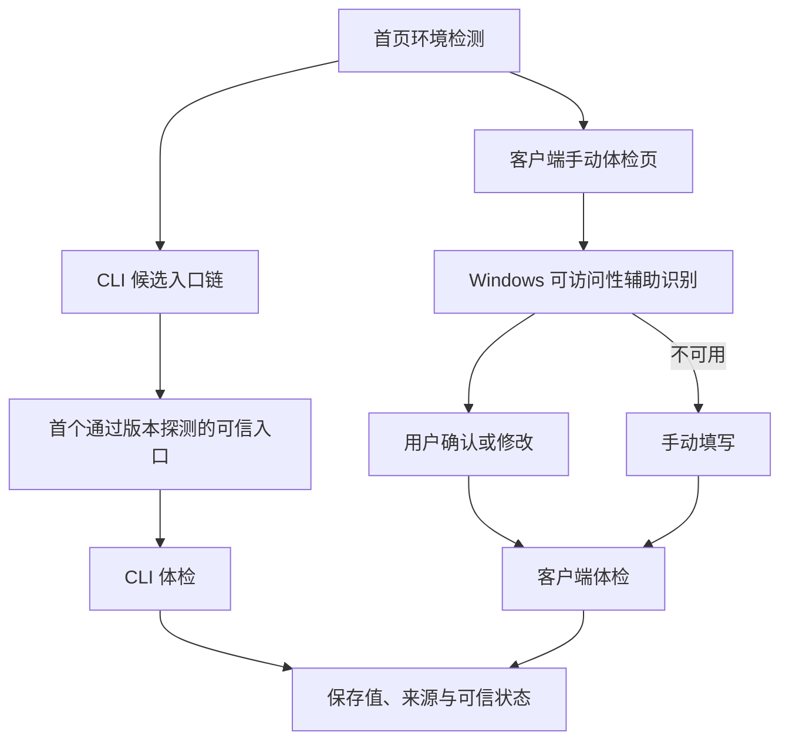

# AI 能力雷达：CLI 可信检测、客户端模型辅助识别与界面重构设计

- 日期：2026-07-20
- 目标版本：v0.2.2
- 状态：已由用户逐节确认，待书面规格复核
- 视觉方向：精密雷达 / 实验室仪表盘

## 1. 背景与已确认问题

v0.2.1 预览验证暴露了三个直接影响可用性的问题：

1. 本机已经通过 npm 安装并可正常运行 Codex CLI，首页仍显示“未检测到可执行入口”。
2. 首页 CLI 区域的标题、题包摘要、重新检测按钮和长说明被挤在同一横向布局中；手动体检页又被全局样式放宽，形成明显的错位和大块空白。
3. 手动体检仍要求用户完整填写模型与推理档位，缺少可信来源和自动辅助。

### 1.1 Codex CLI 误检的实机证据

当前 Windows 环境中的命令搜索结果依次包含：

```text
%APPDATA%\npm\codex
%APPDATA%\npm\codex.cmd
%ProgramFiles%\WindowsApps\OpenAI.Codex_...\resources\codex
%ProgramFiles%\WindowsApps\OpenAI.Codex_...\resources\codex.exe
```

经过审核的 npm 包为 `@openai/codex@0.142.5`，直接使用 Node.js 运行其
`bin/codex.js --version` 成功并输出：

```text
codex-cli 0.142.5
```

现有定位器却先遍历完整 PATH 寻找任意 `codex.exe`，然后才考虑 npm
入口。因此，位于更后方的 Codex 桌面版受限 `codex.exe` 抢在更前方的
npm 安装之前被选中；该 WindowsApps 入口从普通子进程启动时返回“拒绝访问”，
最终被折叠成“未安装”。

这不是用户 PATH 配置错误，而是定位器没有保持 PATH 目录优先级，并且没有在
候选入口失败后继续尝试。

### 1.2 已确认的布局原因

- 首页 `.section-heading-actions` 同时承载题包摘要和最大宽度为 `28rem`
  的 CLI 重新检测说明，宽屏下形成三个彼此分离的视觉锚点。
- `ManualRunPage.css` 原本把页面限制为 `58rem`，但更高优先级的
  `.app-shell .run-page` 又将其覆盖为 `68rem`。
- 手动设置区采用 `1fr / 0.55fr` 两列，页面被放宽后模型输入与档位选择比例
  失衡。
- 页面层级依赖大字号、大空白和大面积边框，信息密度与工具型产品不匹配。

### 1.3 客户端身份不能只看进程名

当前 Codex 桌面应用的可执行文件名实际为 `ChatGPT.exe`，但安装包身份为
`OpenAI.Codex`。因此，客户端辅助识别不能只依赖进程名称；必须组合安装包
身份、顶层窗口和受限的可访问性控件特征。

## 2. 目标与非目标

### 2.1 本次目标

- 修复 Codex CLI 和 Claude Code 在 Windows 上的可信入口定位与失败分类。
- 让当前机器的 npm Codex CLI 被识别为 `codex-cli 0.142.5`。
- 为 ChatGPT/OpenAI 客户端和 Claude 客户端增加 Windows 模型与推理档位
  的尽力辅助识别。
- 所有自动识别结果显示来源和可信状态，并在开始体检前允许用户确认或修改。
- 重构首页和手动体检页的布局，建立统一的“精密雷达”视觉系统。
- 保持源码运行、安装版和免安装版的行为一致。
- 保持旧历史记录兼容，不静默改写已有数据。

### 2.2 明确非目标

- 不根据回答内容、措辞风格或自报身份猜测底层模型。
- 不点击或操控 ChatGPT、Codex、Claude 客户端。
- 不自动切换模型，不创建对话，不发送题目，不抓取对话正文。
- 不读取认证文件、令牌、Cookie 或账户信息。
- 不为检测模型额外发起 AI 请求或消耗订阅额度。
- 不把 Windows UI Automation 宣称为稳定的官方模型接口。
- 不在本次加入 macOS/Linux 客户端窗口识别；这些平台继续使用手填回退。
- 不借本次视觉重构改变题包、评分规则或测试费用边界。

## 3. 总体方案

采用“分层可信识别”：



CLI 入口以实际版本探测为准；客户端模型识别只作为可解释的预填来源。任何
不能核验的默认路由都必须明确标注“未核验”，不能显示成具体模型。

## 4. Windows CLI 可信入口检测

### 4.1 候选数据

定位器不再只返回一个猜测结果，而是生成有序候选：

```text
ProviderLaunchCandidate
  program
  prefix_args
  source_kind: native_exe | reviewed_npm
  provider_kind: codex | claude
```

绝对安装路径只在内存中用于启动，不写入历史、公开报告或普通界面。

### 4.2 保持 PATH 顺序的候选生成

Windows 算法：

1. 按 PATH 原始顺序读取非空、绝对目录。
2. 对每一个目录，先检查同目录中的原生 `codex.exe` / `claude.exe`。
3. 再检查同目录中的 npm shim 是否对应经过审核的官方包布局：
   - `@openai/codex` → `bin/codex.js`
   - `@anthropic-ai/claude-code` → `cli.js`
4. npm 候选必须验证包名、唯一 `bin` 映射、规范化后的包内包含关系，并使用
   PATH 中解析到的 `node.exe` 直接运行入口 JavaScript。
5. 不执行任意 `.cmd`、`.bat`、`.ps1` 或无扩展名 shim。
6. 去重后按产生顺序返回候选。

这样，更前方的可信 npm 安装会排在后方 WindowsApps 桌面资源之前，同时仍保留
同一目录内原生 EXE 的正常优先级。

### 4.3 候选探测与保留

适配器按顺序对候选执行无模型费用的 `--version`：

- 首个在时限内以成功退出码返回合法版本文本的候选成为本次保留入口。
- `AccessDenied`、文件消失、非零退出、超时或异常输出不会立即把目标判为
  “未安装”，而是继续尝试下一个候选。
- 版本探测、登录状态检测和实际体检复用同一保留入口。
- 每次首页重新检测都创建新适配器，因此可以发现当前继承 PATH 目录中的变化。
- 如安装程序新增了应用尚未继承的 PATH 目录，界面仍提示重启应用后再检测。

### 4.4 可解释失败状态

公开状态使用稳定代码，不把原始错误或绝对路径带到前端：

| 状态 | 含义 | 首页文案 |
| --- | --- | --- |
| `ready` | 入口、版本和运行时可用 | 已检测到 |
| `needs_login` | 入口可用但官方状态命令要求登录 | 已安装，需要登录 |
| `not_found` | 没有受支持候选 | 未检测到受支持入口 |
| `runtime_missing` | npm 包存在但 Node.js 不可用 | 缺少 Node.js 运行时 |
| `entry_inaccessible` | 候选存在但均不可启动 | 入口不可访问 |
| `version_probe_failed` | 可启动但版本探测均失败 | 版本检测失败 |

登录状态未知不再把 `installed` 改成 `false`。Claude Code 与 Codex CLI 使用相同
状态协议。

### 4.5 安全边界

- 不通过 shell 拼接或执行任何模型名、档位、题目、路径或用户输入。
- npm 入口继续使用包身份和规范化包含关系校验。
- 单候选与总探测均有时限。
- 只向普通界面暴露脱敏来源标签，如“npm 安装”或“原生安装”。
- 诊断日志不记录认证输出、完整 PATH 或用户目录。

## 5. 客户端模型与档位辅助识别

### 5.1 平台适配器

新增 Windows 专用的只读客户端选择识别服务：

```text
detect_client_selection(target_kind)
  -> ClientSelectionDetection
```

非 Windows 平台返回 `unsupported`，手动输入继续可用。

### 5.2 客户端窗口识别

识别分两层进行：

1. 枚举具有可见顶层窗口的进程，排除 AI 能力雷达自身进程。
2. 组合安装包身份、可执行文件位置、窗口类/标题的非敏感特征和提供方专用
   可访问性锚点，区分：
   - ChatGPT/OpenAI 客户端；
   - Codex 桌面客户端；
   - Claude 客户端。

进程名只作为弱信号，不能单独决定提供方。OpenAI 客户端目标允许适配 ChatGPT
和 Codex 桌面界面，但界面会明确显示实际识别到的客户端表面。

### 5.3 可访问性扫描限制

- 使用 Windows UI Automation 只读接口。
- 只遍历顶层窗口上方标题/工具栏区域中的 `Button`、`ComboBox`、
  `MenuItem` 等选择器控件。
- 明确排除 `Document`、聊天记录、正文容器、消息列表和文本输入控件。
- 对树深度、访问节点数、字符串长度和总耗时设置硬上限。
- 在阻塞线程中执行，并由异步命令设置总超时，避免卡住 Tauri 主线程。
- 不保留完整可访问性树，不写入原始控件文字或窗口标题全集。

### 5.4 提取与候选结果

服务只返回经过限制和校验的候选：

```text
ClientSelectionDetection
  status:
    detected | multiple | not_running | not_exposed |
    unsupported | timed_out | failed
  candidates[]

ClientSelectionCandidate
  model?
  reasoning_effort?
  surface: chatgpt | codex_desktop | claude
  source: windows_accessibility
  confidence: visible_selector | best_effort
```

- 模型名保留客户端可见文本，经现有可显示字符和长度规则校验。
- 已知推理档位映射到共享规范值；未知但安全的可见标签进入现有自定义值流程。
- 一个明确候选时自动预填并显示“待确认”。
- 多个候选时不猜测，显示候选供用户选择。
- 识别失败、超时或客户端未运行时不阻塞手动填写。
- 用户修改任何预填值后，来源状态立即变为“用户已修改”。

### 5.5 自动触发

- 进入 ChatGPT/OpenAI 或 Claude 手动体检设置页时自动尝试一次。
- 页面提供“重新识别”按钮。
- 自动识别可以在本地设置中关闭；关闭后始终手填。
- 点击“开始快速体检”表示用户确认最终模型和档位。
- 识别过程不发送提示词，不产生 AI 调用费用。

### 5.6 适配器易变性

客户端更新可能改变可访问性树。识别规则必须按提供方分模块维护，解析器使用
合成树单元测试。客户端结构变化只应导致 `not_exposed` 或手填回退，不能导致
错误模型被静默保存。

## 6. 模型来源与可信状态

现有 `TargetSelection` 增加向后兼容的可选元数据：

```text
model_source:
  manual
  windows_accessibility
  cli_requested
  cli_reported
  default_route
  legacy_unknown

model_verification:
  user_confirmed
  provider_reported
  unverified
  legacy_unknown
```

规则：

- 手填或由客户端预填后点击开始：`user_confirmed`。
- CLI 明确传入 `--model`：来源为 `cli_requested`；界面称“本次明确指定”，
  不夸大为服务端已核验。
- 只有提供方结构化输出明确给出模型时才使用 `cli_reported` /
  `provider_reported`。
- 未指定 CLI 模型且输出未报告时，保存稳定占位值并显示“CLI 默认路由
  （未核验）”，不猜具体模型。
- 旧记录缺少字段时按 `legacy_unknown` 显示，不修改原数据。
- 历史、结果、恢复和公开报告使用同一套来源文案。

数据库或序列化升级必须提供默认值，保证旧记录可读取。恢复一次中断运行时，
最终模型、档位、来源和可信状态都必须匹配原运行。

## 7. “精密雷达”视觉系统

### 7.1 设计原则

- 工具感来自清晰的信息层级、测量刻度和状态反馈，不依赖装饰性大图。
- 使用暖白画布、深墨绿正文、雷达青操作色和少量琥珀警示色。
- 背景网格降低对比度，只作为空间参照。
- 不使用联网字体、外部图片或大面积渐变。
- 圆角、胶囊标签和阴影只用于表达层级，不让所有文字都变成徽章。

### 7.2 共享令牌

统一定义并复用：

- 画布、面板、面板强调、边框、正文、次要文字、操作、成功、警告、错误颜色；
- `4/8/12/16/24/32/48px` 间距序列；
- 小、中两档圆角；
- 面板阴影、悬停阴影和聚焦轮廓；
- 标题、正文、注释和数据标签字号；
- 桌面、紧凑桌面和单列断点。

字体使用本机优先栈：`Segoe UI Variable`、`Microsoft YaHei UI` 和可靠系统
回退，保持离线和中文可读性。

### 7.3 应用外壳与首页

- 主版心统一，顶栏与内容左右边界对齐。
- 顶栏减小高度，以清晰的当前页面标记代替大面积按钮。
- 首页 Hero 压缩为标题、简短说明和一条隐私/费用摘要，不再占据大块空白。
- “聊天客户端”和“编程 CLI”各自拥有紧凑区头：
  - 左侧：类别、标题和题包摘要；
  - 右侧：唯一主要操作；
  - 长说明位于区头下方的独立提示条。
- 目标卡使用一致结构：提供方标识、版本/模式、状态、前置条件、主操作。
- 状态同时使用图标、文字和颜色，避免只靠颜色表达。

### 7.4 手动体检设置页

- 页面设置稳定的阅读宽度，不再被全局 `68rem` 规则意外放大。
- Hero 只保留眉题、标题和一句流程说明。
- 费用与隐私说明使用紧凑信息面板。
- 模型识别区形成一个完整面板，顺序为：
  1. 识别状态与“重新识别”；
  2. 模型来源和可信状态；
  3. 模型与推理档位的平衡双列字段；
  4. 新建空白对话确认；
  5. 帮助文字和开始按钮。
- 宽屏双列比例保持平衡；紧凑宽度自动单列。
- 自动预填、手动修改、错误与禁用状态使用稳定布局，避免状态变化引起页面跳动。

### 7.5 响应式与可访问性

- 在常见桌面宽度、`1366×768`、`1024px` 宽窗口及窄窗口下检查。
- 不出现水平滚动、控件遮挡、标题与操作分离过远。
- 保持语义标题、字段标签、状态 `aria-live`、键盘顺序和可见焦点。
- 文字和关键控件满足 WCAG AA 对比度。
- 遵守 `prefers-reduced-motion`，动画只用于短暂状态过渡。

## 8. 前端交互状态

### 8.1 首页 CLI 卡

首页可见状态包括：

- 正在检查；
- 已检测到，显示公开版本和入口来源；
- 已安装，需要登录；
- 未检测到受支持入口；
- 缺少 Node.js；
- 入口不可访问；
- 版本检测失败。

每个失败状态提供与该状态对应的简短下一步，不再统一写成“未安装”。

### 8.2 客户端模型识别

可见状态包括：

- 正在读取客户端界面；
- 已从 ChatGPT/OpenAI、Codex 或 Claude 界面读取，待确认；
- 发现多个候选，请选择；
- 客户端未运行；
- 当前客户端未公开选择器，可手填；
- 读取超时，可重试或手填；
- 用户已修改。

开始按钮只受最终字段校验和现有确认项约束；自动识别失败本身不会禁用开始。

### 8.3 CLI 模型记录

- 明确填写模型：显示“本次明确指定”。
- 留空：显示“CLI 默认路由（未核验）”。
- 结构化输出报告模型：运行完成后显示“CLI 已报告”。
- 推理档位继续按目标显示已知预设，并保留受限自定义入口。

## 9. 错误处理

- CLI 候选探测逐个失败：返回聚合后的稳定失败代码，不暴露原始输出。
- UI Automation 初始化失败：返回 `failed`，手填仍可用。
- 客户端窗口不存在：返回 `not_running`，不弹系统级错误。
- 扫描达到上限：返回 `timed_out`，终止本次扫描。
- 解析到不安全或超长文本：丢弃该候选，不带入表单。
- 多个模型或多个窗口：要求用户选择，不自动选第一个。
- 历史记录来源字段缺失或未知：显示“历史记录，来源未知”。
- 前端后端协议不匹配：运行时校验失败并显示通用本地错误，不使用未验证字段。

## 10. 隐私、费用与安全

- 客户端识别完全在本机执行。
- 不上传窗口、模型、档位或原始可访问性数据。
- 不读取或保存聊天内容。
- 不访问客户端登录凭据。
- CLI 环境检测只运行版本和官方只读状态命令。
- 自动化测试只使用假 CLI 和合成可访问性树。
- 只有用户主动开始真实 CLI 体检时才可能消耗其订阅额度。
- 公开报告只包含用户已经确认并允许发布的模型、档位、来源与可信状态。

## 11. 测试策略

实现遵循测试驱动顺序。

### 11.1 Rust 单元与集成测试

- PATH 前方为有效 npm Codex、后方为拒绝访问的原生 EXE；
- 前方原生入口失败后回退到后方可信 npm 入口；
- 原生 Codex、原生 Claude、两种官方 npm 布局；
- 缺少 Node、伪造包名、伪造 `bin`、包外符号链接、相对 PATH；
- `not_found`、`runtime_missing`、`entry_inaccessible`、
  `version_probe_failed` 和 `needs_login` 分类；
- 检测与执行复用同一通过验证的入口；
- 合成 OpenAI/Codex/Claude 可访问性树的模型与档位提取；
- 排除 Document、输入框、对话区域和超长文本；
- 多窗口、多候选、超时、节点上限和非 Windows 回退；
- 新来源字段的序列化、旧数据默认值、恢复一致性和报告展示。

### 11.2 前端测试

- 首页每一种 CLI 状态与对应操作；
- 重新检测加载、成功与失败；
- 客户端识别的自动触发、候选选择、重新识别和手填回退；
- 自动值修改后来源状态变化；
- CLI 默认路由不显示成具体模型；
- 旧历史来源兼容；
- 键盘、焦点、标签、实时状态和错误关联；
- 组件在紧凑与单列布局下的结构契约。

### 11.3 视觉验收

使用真实 Tauri 页面或等价受控浏览器视图检查：

- 首页常见桌面、`1366×768`、`1024px` 和窄窗口；
- ChatGPT/OpenAI 与 Claude 手动体检设置页；
- CLI 就绪、失败和重新检测状态；
- 模型识别成功、多候选和失败回退；
- 无水平溢出、重叠、异常大空白和跳动。

### 11.4 完整回归

- 前端全部测试与生产构建；
- Rust workspace 全部测试；
- `cargo fmt --check`；
- 严格 `cargo clippy`；
- 仓库契约验证器；
- sealed fake CLI E2E；
- 许可证与离线安全审计；
- 安装包与免安装包构建回归。

自动回归不运行真实 AI 测试。

## 12. 实机验收

当前开发机必须满足：

1. 首页把 npm Codex CLI 显示为已检测到，并公开版本 `codex-cli 0.142.5`。
2. 后方受限 WindowsApps `codex.exe` 不再遮挡 npm 安装。
3. 重新检测不产生模型费用。
4. 当前 OpenAI/Codex 桌面窗口可进入辅助识别流程；可读时显示来源并要求确认，
   不可读时稳定回退手填。
5. 因本机暂未安装 Claude 客户端，Claude 使用合成树完成自动化验收，并保留
   后续真机验证项。
6. 首页和手动体检页符合已确认的“精密雷达”视觉方向。
7. 通过 `npm start` 重新打开最新源码版供用户直接试用。

## 13. 与既有规格的关系

本规格增量覆盖此前设计中以下内容：

- Windows CLI 定位顺序和单候选失败行为；
- 客户端“完全不读取模型界面”的非目标，调整为受限、只读、需确认的辅助识别；
- 首页 CLI 区域和手动体检设置页的布局；
- 模型来源与可信状态记录。

既有题包、评分、费用、原始回答本地保存、免安装包完整性和公开报告脱敏约束
继续有效。
